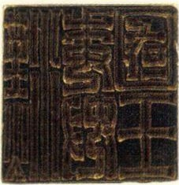
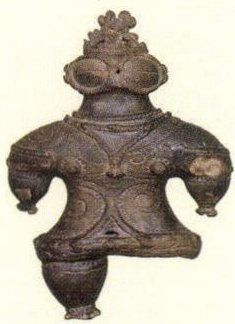
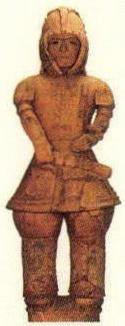
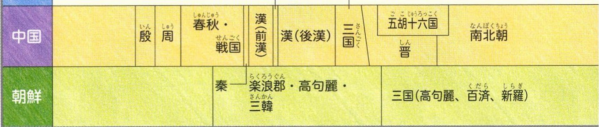

# p.558 (印刷頁 554)
[← p.557](page_0557.md) | [📖 目次](index.md) | [p.559 →](page_0559.md)

---

### こふん
古墳時代
やよい
弥生時代
じょうもん
縄文時代
旧石器時代
時代
(五五二）五三八四七八
ぶつきよう
仏教が正式に伝来する
わおぶそう
倭王武が中国の南朝（宋）に使い
せき四世紀
ごろ
二三九
邪馬台国の卑弥呼が魏に使いを送る2またいこくみQ き

### 五七

> **種類**: photo  
> **説明**: 古代の金属製の印(印影)を写した写真。四角い印面に文字が刻まれており、弥生時代に中国(後漢)から授けられたとされる金印などの歴史資料として紹介されていると考えられる。  
> **主要素**: 四角い印(はんこ)の印面, 刻まれた文字, 古びた金属の質感
いなさくきんぞくきせいどうき
稲作、金属器(鉄器・青銅器)が伝わる

### 約一万年前
かさいしう

> **種類**: photo  
> **説明**: 縄文時代につくられた土偶を写した写真。頭部や胸、腕などに独特の文様が施された素焼きの人形型の土製品で、祈りや儀式に使われたと考えられている。  
> **主要素**: 土偶(素焼きの人形), 頭部の装飾, 胸や腕の文様

### 日本のできごと

### 11重要歴史年表

> **種類**: photo  
> **説明**: 古墳時代につくられた武人埴輪を写した写真。よろいやかぶとを身につけた人物の姿を表した素焼きの埴輪で、古墳の周りに並べられたものと考えられている。  
> **主要素**: 武人埴輪(素焼きの人物像), よろい・かぶとの表現, 古墳時代の副葬品
はにわ
金印
土偶

### 古墳文化

### 弥生文化

### 縄文文化
古墳はにわじき上う漢字儒教よさんたお養蚕機織り仏教
だいせん
大仙古墳
弥生土器

石包丁田げた
たかゆか

高床倉庫

どうたく

銅鏡 銅鐸
よしのがり

吉野ヶ里遺跡
縄文土器
あじのうき
たて穴住居
かいづか
貝塚
どぐう
土偶
さんいまやまいせ
三内丸山遺跡
日本の文化
前四ごろイエスが生まれる
し<(魏·呉·蜀)
し人しこうてい
前六世紀シャカが生まれる

### 古代文明
中国文明
インダス文明エジプト文明メソポタミア文明
世界のできごと

---
[← p.557](page_0557.md) | [📖 目次](index.md) | [p.559 →](page_0559.md)
