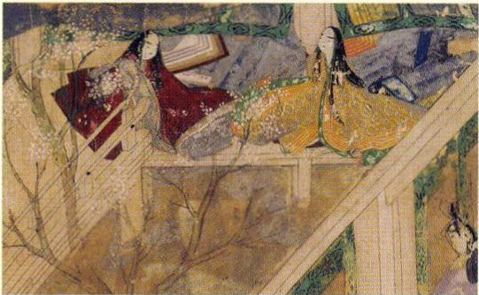
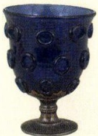

# p.559 (印刷頁 555)
[← p.558](page_0558.md) | [📖 目次](index.md) | [p.560 →](page_0560.md)

---
かま<5鎌倉時代
へいあん
平安時代
なら奈良時代
こふん
古墳時代
あすか
飛鳥時代
こうあん

一三二八一弘安の役げんこう
ぶんえいえき元寇
一三二七四文永の役
うう
せいいたいしょうくん
源頼朝が征夷大将軍となる
C5S 门とう
源頼朝が守護・地頭を置くだんのうち
壇ノ浦の戦いで平氏がほろびる
きよもり2G 

平清盛が太政大臣となる
(5

平治の乱
2いせい
白河上皇が院政を始める
2d
いあんきよう
はくすきのえ
白村江の戦い
たいかかいしん
大化の改新が始まる
せ
地

政

福
歷史

際

> **種類**: illustration  
> **説明**: 平安時代の貴族の生活を描いた源氏物語絵巻の一場面。屋内で横になる十二単姿の女性たちが色彩豊かな筆致で描かれている。  
> **主要素**: 十二単姿の女性たち, 御簾や几帳などの室内調度, 平安時代の貴族の邸宅の様子

> **種類**: photo  
> **説明**: 正倉院に伝わる瑠璃(ガラス)製の坏(杯)を写した写真。青いガラスに丸い装飾模様が施された、シルクロードを通じて伝来したとされる工芸品。  
> **主要素**: 青いガラス製の坏(杯), 表面の丸い装飾模様, 台座の付いた形状

### 飛鳥文化
ほうりうじ
法隆寺
しやかさんぞんぞう
法隆寺釈迦三尊像
こうりうじみろくほさつう
広隆寺弥勒菩薩像
たましのずし
玉虫厨子
す
紙・墨の伝来

### 天平文化

### 国風文化
にほんしよき『古事記』『日本書紀』ふどきまんようしう『風土記』『万葉集』しょうそういんとうしうだいじ正倉院唐招提寺
げんじ
かな文字『源氏物語』こきんま<のうし『古今和歌集』枕草子』しんでんつくりえし2うとさょう寝殿造大和絵净土教
新しい仏教てんだいしうしんこんしう天台宗真言宗

### 鎌倉文化
じ23どしうじょうどしんう
浄土宗浄土真宗
りんさいしうそうとうしうじう
臨済宗曹洞宗時宗
ちれしうこんこうりきしう
日蓮宗金剛力士像
『新古今和歌集』

つれつれぐさへいけ
『徒然草』『平家物語』
もうこし0うらいえことば

「蒙古襲来絵詞」
一二七一フビライハンが
げ
国号を元とする

### 一三二〇六
チンギス=ハンがモンゴルを統一

### 一〇九六九六〇九三六九〇七
J 

2o
5ちょうせん
六七六新羅が朝鮮半島を統一
六一八唐が建国される六一〇ムハンマドがイスラごろム教を開く
とういつ五八九隋が中国を統一
元
モンゴル（南宋)
こだい五代
a>C2>2γ2くだ5三国（高句麗、百済、新羅）

---
[← p.558](page_0558.md) | [📖 目次](index.md) | [p.560 →](page_0560.md)
