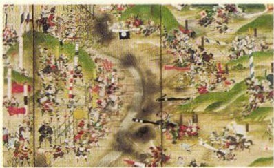
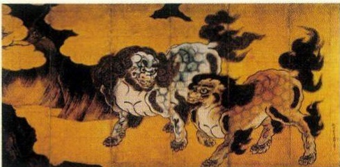
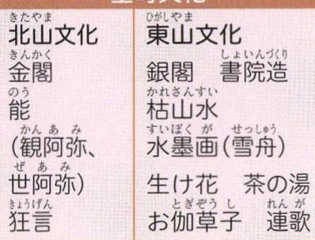

# p.560 (印刷頁 556)
[← p.559](page_0559.md) | [📖 目次](index.md) | [p.561 →](page_0561.md)

---
えど
江戸時代
時代
あつちももやま
せんごく
戦国時代
むろまち
室町時代
人ぼくちう南北朝時代
一七七二一七一六一七〇九一六四一一六三七一六三五一六一五一六〇三一六〇〇一五九七一五九二一五九〇一五八八一五八二一五七五一五七三一五六〇一五四九一五四三一四八九一四六七O 一三九二一三七八一三三八三三Ⅲ
ぬおつくろうじう
不可
さ
しまばら0
いえみつ

徳川家光が参勤交代を制度化する
ぶはとせいてい

武家諸法度の制定

とくがわいえや
けいちょう
慶長の役ちょうせんしんりくぶんろくえき朝鮮侵略文禄の役
豊臣秀吉が全国を統一するかれい
刀狩令が出される
不
室町幕府がほろびる
おけはざま

桶狭間の戦い
キリスト教が伝えられる
ねしまてぼう

不
可
心

足利義満が室町に「花の御所」をつくる
あしかがかうし

足利尊氏が室町幕府を開く传所
後醍醐天皇が建武の新政を始める告有
かまくらばくふ

鎌倉幕府がほろびる

### 日本のできごと
元
こうらい高麗

> **種類**: illustration  
> **説明**: 戦国時代の合戦の様子を描いた屏風絵。多数の武士や騎馬武者が入り乱れて戦う様子が描かれ、旗指物や鉄砲隊とみられる描写も見られる。  
> **主要素**: 騎馬武者や足軽の群像, 旗指物, 戦場の煙や混戦の様子

> **種類**: illustration  
> **説明**: 桃山時代の障壁画の代表例である唐獅子図屏風の一部。金地の背景に力強い筆致で2頭の唐獅子(想像上の獅子)が描かれている。  
> **主要素**: 2頭の唐獅子, 金地の背景, 桃山文化の豪華な障壁画
清
朝鮮
日本の文化

### 室町文化

### 桃山文化
ひめじ

姫路城

さどうせりう

茶道（千利休）

しょうへきがかのうえいく

障壁画（狩野永徳）

おど

かぶき踊り

いずもおくに
(出雲の阿国)
ありたやきとうこう
有田焼(朝鮮の陶工)

### 元禄文化
うよえひしかわもろのぶ浮世絵（菱川師宣）そうしょくがたわやそつ装饰画（俵屋宗達）はいかいまつおばしょう
俳諧（松尾芭蕉）うきよぞうしいはらさいかく浮世草子（井原西鶴）じょうりちかまつん人形浄瑠璃（近松門えんかぶき左衛門）歌舞伎
せんげん一七七六アメリカ独立宣言
このころ産業革命が始まる
一六八八一六四四
2
一六〇二オランダが東インド
会社を設立
一五八一
オランダがスペイン
ど<つつ

から独立
一五四三
コペルニクスが地動説を発表する
一五三四三一
イエズス会の成立マゼランー行が世界一周達成
一五一七
しうきょう
ルターが宗教改革を
始める
一四九八
インドに到達
一四九二
コロンブスが西インド諸島に到達
一三九二朝鮮が建国される
みん
世界のできごと

---
[← p.559](page_0559.md) | [📖 目次](index.md) | [p.561 →](page_0561.md)
