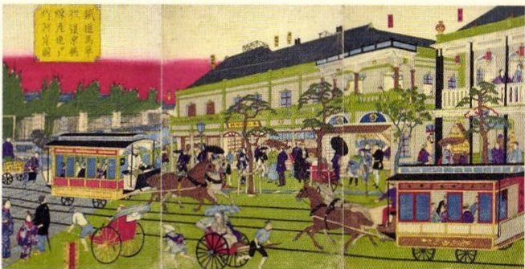
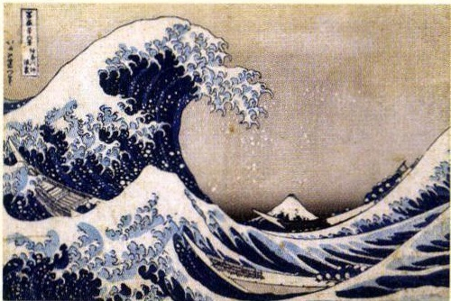

# p.561 (印刷頁 LSS×XXXXXXXXXXXXXXX)
[← p.560](page_0560.md) | [📖 目次](index.md) | [p.562 →](page_0562.md)

---

### めいじ
明治時代
江戸時代
一八九〇一八八九一八八六一八八五一八八二11
一八八一一八七七一八七六一八七五一八七四一八七三一八七二一八七一一八六九一八六八一八六七一八六六一八六〇11
一八五八一八五四一八五三一八四一一八三七一八三三一八二五一七八七一七八二
=<
じょうき

> **種類**: illustration  
> **説明**: 明治時代の文明開化期の東京の様子を描いた錦絵。鉄道馬車や洋風建築、洋装の人々や人力車などが描かれ、西洋文化が取り入れられていく都市の姿を表している。  
> **主要素**: 鉄道馬車(路面電車), 洋風の建築物, 人力車と馬車, 洋装・和装が混在する人々
所
,
日米和親条約,不
らいこう
てんぼう

> **種類**: illustration  
> **説明**: 葛飾北斎の浮世絵「冨嶽三十六景 神奈川沖浪裏」。荒れる大波の合間に富士山が小さく見え、波間には小舟が描かれた江戸時代の代表的な木版画。  
> **主要素**: 大きくうねる波の描写, 波間に浮かぶ小舟, 遠景に見える富士山
まつだいちだのぶかせいかいかく

松平定信の寛政の改革（(九三)
てんめい

天明のききん（八七)
地

理

福
歷史

際

### 化政文化
うきよえうたがわひろしげかつしかほくさいきた
浮世絵（歌川広重、葛飾北斎、喜多
がわたまろ

川歌麿）

とうかいどうちうひざ<りげじつぺんしいく
『東海道中膝栗毛』(十返舎一九）
はいかいこやしいっさせ人りうきょうか
俳諧（小林一茶）川柳·狂歌
こじでんもとおりのりなが

『古事記伝』(本居宣長)

かいたいしんしょすたげんばくまえのりようた
『解体新書』(杉田玄白・前野良沢)

### 文明開化
だんばつ
断髪洋服洋食ガス灯
たいようれき3<
太陽暦レンガ造りの建物
(す)ふくさわゆち
『学問のす>め』(福沢諭吉)
鉄道の開通電信の開通
ゆうびん
郵便制度
さつし
新聞・雑誌の発行
どうめい

一八八二三国同盟(ドイツ・
オストリア・
イタリア)

エジソンが白熱電球
を発明する
一八七一 ドイツ帝国の成立
11アメリカで南北戦争
一八六一イタリア王国の成立
たいへいてこく
一八四〇中国でアヘン戦争
こうていそく
一七八九フランス革命
清ちょうせん

---
[← p.560](page_0560.md) | [📖 目次](index.md) | [p.562 →](page_0562.md)
