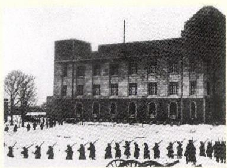
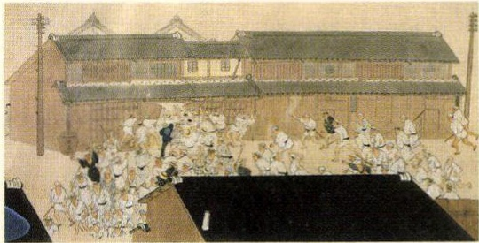

# p.562 (印刷頁 558)
[← p.561](page_0561.md) | [📖 目次](index.md) | [p.563 →](page_0563.md)

---
しようわ
昭和時代
たいしよう
大正時代
めいじ
明治時代
時代
"一九四一一九四〇一九三八一九三七一九三六一九三三一九三二一九三一
一九二五一九二三
一九一八一九一五一九一四
一八九四一八九〇
にちどくい
そう

> **種類**: photo  
> **説明**: 雪の積もる中、銃を持った兵士たちが建物の前を行進する白黒写真。昭和初期に起きた軍事クーデター未遂事件(二・二六事件)の様子を伝える歴史資料と考えられる。  
> **主要素**: 雪の積もった街並み, 銃を持ち整列する兵士たち, 背景の大きな建物
ふつう
こめそうどう
可

> **種類**: illustration  
> **説明**: 江戸時代の一揆や打ちこわしの様子を描いた絵。白装束姿の大勢の人々が商家や役所らしき建物に押し寄せている場面が描かれている。  
> **主要素**: 白装束姿で押し寄せる群衆, 襲われている建物, 混乱した江戸時代の町の様子
かんぜかいふく
関税自主権の完全回復に成功韓国併合
54v 门)はつぶ教育勅語の発布

### 日本のできごと
A二·二六事件

### 大正・昭和初期の文化

### 明治の文化
みんぼんしよしのさくぞうかにこうせんこばやしたきじ
民本主義（吉野作造）『蟹工船』(小林多喜二)
ようもんあたがわりうのすけいずおりこかわばたやすり
『羅生門』(芥川龍之介)『伊豆の踊子』(川端康成)
ラジオ放送開始(1925)

えいがちくおんき

映画蓄音機スポーツ
まいひめもりおうがいいしかわたくぼく
『舞姫』(森鷗外)短歌（石川啄木）
ぼなつめそうせ
『坊っちゃん』(夏目漱石)
ひちいちよう

『たけくらべ』(樋口一葉)
がよさのあきこ

『みだれ髪』(与謝野晶子)
せいとうひらつか(ちょう)

『青』(平塚らいてう)

きさしばさぶろうのぐちひでよ
科学(北里柴三郎·野口英世）
日本の文化
こうふく
(四五)
一九三八ドイツがオストリアを併合
一九二九一九二三
きんうこう世界恐慌
ソビエト社会主義れぼう
共和国連邦の成立
一九二〇
ほそく国際連盟の発足
第一次世界大戦
一九一二一九一一九〇七
(一八)
ちうか

中華民国の成立
しんがいかくめい

辛亥革命
三国協商(イギリス・
フランス・ロシア)

### 一八九六
第一回近代オリンピック(アテネ)
世界のできこと
中華民国
りょう(日本領)
だいかん大韓ていこく帝国
ちょうせん朝鲜

---
[← p.561](page_0561.md) | [📖 目次](index.md) | [p.563 →](page_0563.md)
