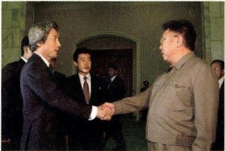
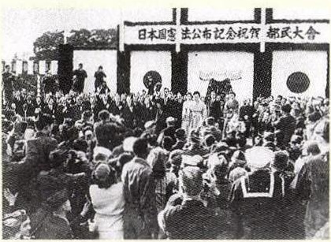

# p.563 (印刷頁 559)
[← p.562](page_0562.md) | [📖 目次](index.md) | [p.564 →](page_0564.md)

---
れいわ令和時代
二〇一九令和に改元
一九九二一九七八一九七三
けんりしうにん
子どもの権利条約を承認する
じ

> **種類**: photo  
> **説明**: 日本の首相とみられる人物が握手を交わす写真。北朝鮮訪問時の日朝首脳会談の様子を伝える現代の外交資料と考えられる。  
> **主要素**: 握手を交わす二人の人物, 背後に控える随行者たち, 室内での会談の様子
たいさく

公害対策基本法の制定
にかん

日韓基本条約
新日米安全保障条約
一九五六一九五四
日ソ共同宣言ほそく自衛隊の発足
せしだくむじょうけんこうふく

> **種類**: photo  
> **説明**: 日本国憲法の公布を記念して開かれた祝賀集会の白黒写真。「日本国憲法公布記念祝賀 都民大会」と書かれた横断幕の下、多くの人々が集まっている。  
> **主要素**: 「日本国憲法公布記念祝賀 都民大会」の横断幕, 壇上に立つ人々, 集まった大勢の群衆
ほりうじひめじいさん法隆寺や姫路城が日本初の世界文化遺産になる(1993)
かわひできし上う湯川秀樹がノーベル賞を受賞(1949)
とうかいどうしんかんせん
東海道新幹線開通(1964)東京オリンピック・パラリンピック(194)
長野冬季オリソピック・パラリンピック(1998)きょうさい
日韓共催サッカーワールドカッ(2002)
ばんこ<はくらんかい
日本万国博覧会(大阪、1970)日本国際博覧会(愛知、2005)
さつぽろ
札幌冬季オリンピック(1972)
テレビ放送開始(1953)
東京オリンピック・パラリンピック(2021)
地

理

政治
歷史

国

際
んた加人新型コロナウイルス感せんしょう
染症が世界的に流行
かいたいわんがん

とういつ
ちうとう
一九七三第四次中東戦争
げきか一九六五ベトナム戦争激化
こうわ
うか
このころ冷たい戦争(冷戦)が始まる
一九四五国際連合の発足

### 中華人民共和国
たいわん(台湾)
だいかんみんこく大韓民国
しo 朝鲜民主主義人民共和国

---
[← p.562](page_0562.md) | [📖 目次](index.md) | [p.564 →](page_0564.md)
