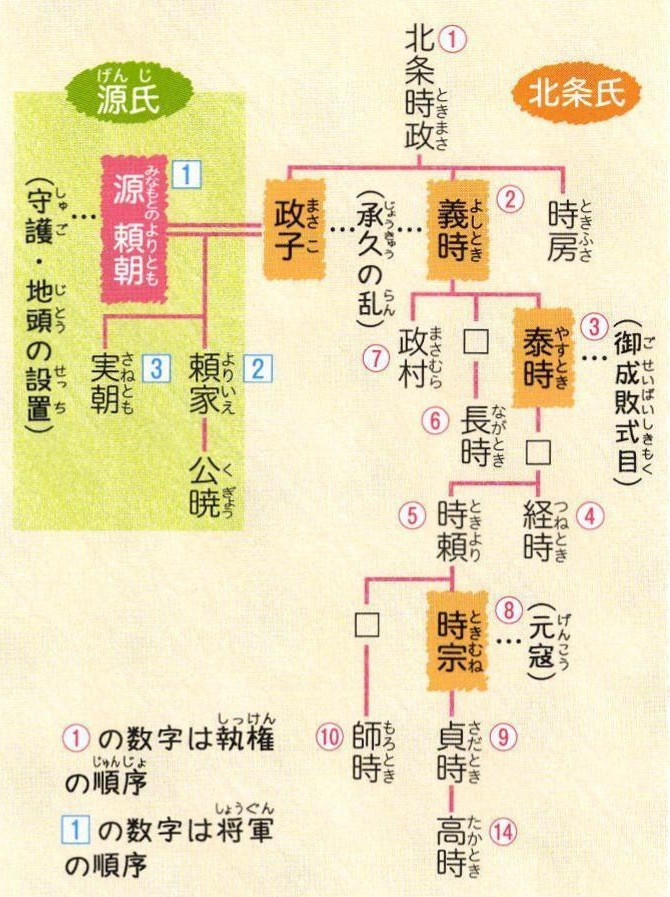
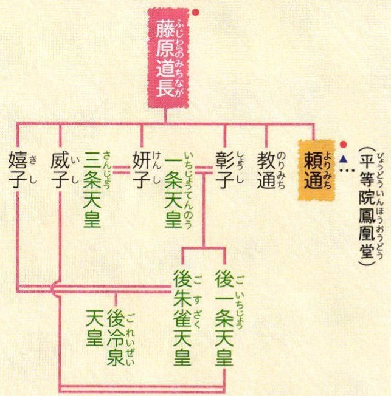
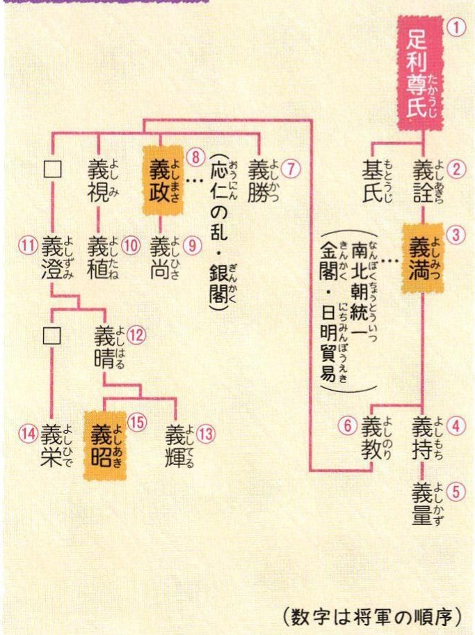
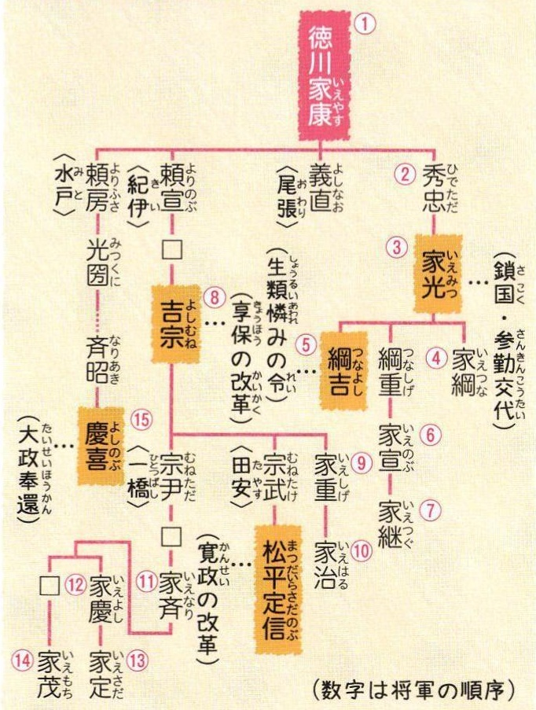

# p.575 (印刷頁 571)
[← p.574](page_0574.md) | [📖 目次](index.md) | [p.576 →](page_0576.md)

---

### 22系図

### ふじわらこうしつけいず藤原氏と皇室の系図
へいあんせかんせいじぜんせいき(平安時代。摂関政治全盛期)

> **種類**: diagram  
> **説明**: 鎌倉幕府の執権を務めた北条氏の系図。源頼朝との関係や執権就任順、承久の乱・御成敗式目・元寇などの出来事が示されている。  
> **主要素**: 北条時政, 北条義時, 北条泰時, 北条時宗, 源頼朝, 執権の順序, 承久の乱, 御成敗式目, 元寇

> **種類**: diagram  
> **説明**: 摂関政治で栄えた藤原道長を中心とした系図で、娘たちが天皇や皇后に嫁いだ関係を示している。  
> **主要素**: 藤原道長, 三条天皇, 一条天皇, 後一条天皇, 後朱雀天皇, 後冷泉天皇, 頼通
せつしょうかんぱ<（·摂政関白）

### あしかが
足利氏の系図

> **種類**: diagram  
> **説明**: 室町幕府を開いた足利氏の将軍系図。将軍の就任順序と応仁の乱・南北朝統一・日明貿易・金閣銀閣などの出来事を関連付けている。  
> **主要素**: 足利尊氏, 足利義満, 足利義政, 将軍の順序, 応仁の乱, 南北朝統一, 日明貿易

### とくがわ
徳川氏の系図

> **種類**: diagram  
> **説明**: 江戸幕府を開いた徳川家の将軍系図。将軍就任順序と鎖国・参勤交代・生類憐みの令・享保の改革・寛政の改革・大政奉還などの出来事を示す。  
> **主要素**: 徳川家康, 徳川家光, 徳川吉宗, 徳川慶喜, 将軍の順序, 鎖国, 参勤交代, 享保の改革, 大政奉還
えど
(江戸時代)
地

理

2
治

---
[← p.574](page_0574.md) | [📖 目次](index.md) | [p.576 →](page_0576.md)
