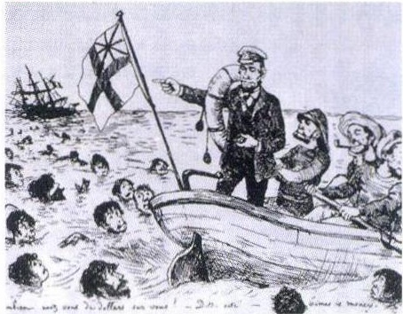
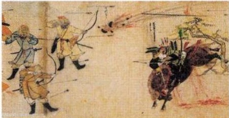
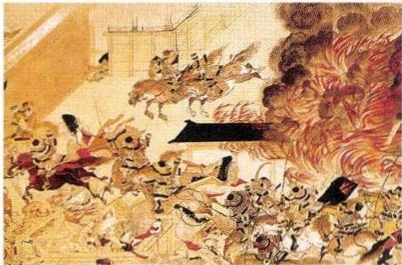
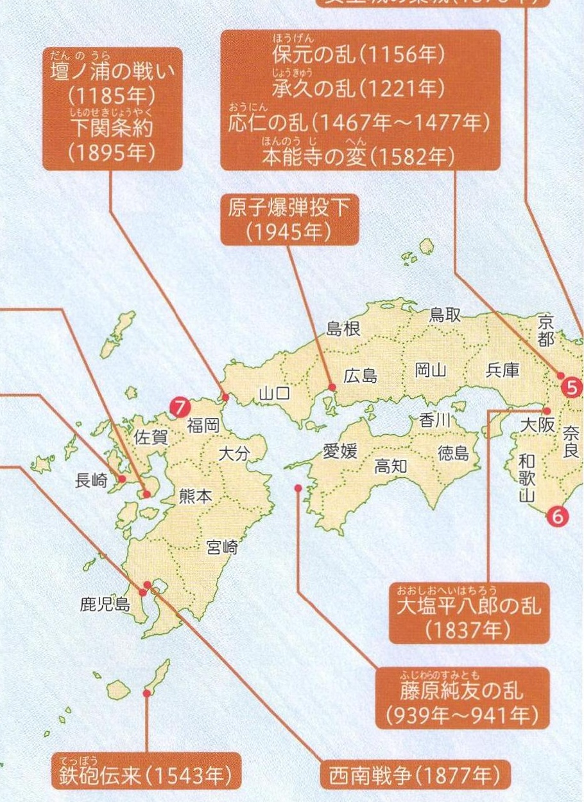

# p.578
[← p.577](page_0577.md) | [📖 目次](index.md) | [p.579 →](page_0579.md)

---

### 2歴史地図のまとめ
しめ

中学入試によく出題されるできごとのあった位置を日本地図で示しました。ど
かくにん

こで、何がおこったのかを確認しましょう。

> **種類**: illustration  
> **説明**: ノルマントン号事件を風刺した絵で、イギリス人船長が救命ボートに乗り込み、海に投げ出された日本人乗客を見捨てている場面が描かれている。  
> **主要素**: イギリス国旗, 救命ボート, 船長, 海で溺れる日本人乗客, 沈む船
1886年。これをきっかけに国民の間で条約改正の声が高まった。
しまばらあまくさいっき島原·天草一揆（1637年~1638年）
んしばくだん
原子爆弹投下（1945年）
らいこう
ザビエル来航(1549年)

### fん23元寇

> **種類**: illustration  
> **説明**: 元寇の様子を描いた絵巻の一場面で、モンゴル軍(元軍)の兵士が弓矢と「てつはう」を用いて日本の武士と戦っている。  
> **主要素**: 元軍の騎馬武者, 弓矢, てつはう(火薬兵器), 日本の武士
ぶんえいえき21274年が文永の役、1281年が弘あん
安の役。

> **種類**: illustration  
> **説明**: 本能寺の変を描いた絵で、炎に包まれる本能寺と、明智光秀軍による襲撃の合戦の様子が描かれている。  
> **主要素**: 炎上する本能寺, 騎馬武者, 合戦の様子
たいらのきよもりみものよしとも
1159年。平清盛が源義朝を
やぶ

破った。

### あちちくしよう

> **種類**: map  
> **説明**: 中国・四国・九州地方を示す地図で、壇ノ浦の戦い、保元の乱、承久の乱、応仁の乱、本能寺の変、原子爆弾投下、大塩平八郎の乱、藤原純友の乱、鉄砲伝来、西南戦争などの歴史的出来事が起きた場所と年代が示されている。  
> **主要素**: 京都, 長崎, 広島, 鹿児島, 壇ノ浦の戦い, 原子爆弾投下, 西南戦争, 鉄砲伝来

---
[← p.577](page_0577.md) | [📖 目次](index.md) | [p.579 →](page_0579.md)
