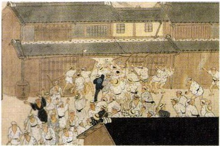
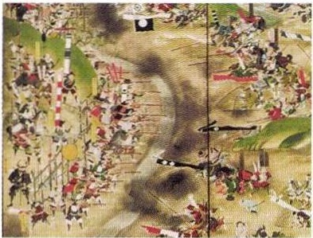
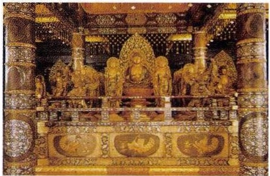
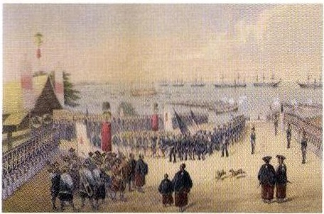
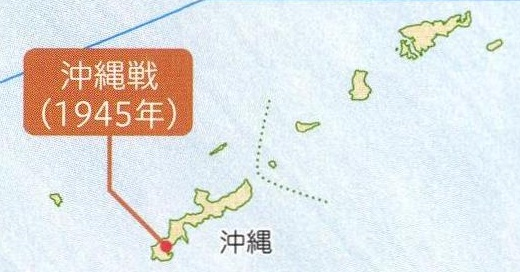

# p.579 (印刷頁 575)
[← p.578](page_0578.md) | [📖 目次](index.md) | [p.580 →](page_0580.md)

---

### こめそうどう©米騒動

> **種類**: illustration  
> **説明**: 江戸時代の打ちこわしの様子を描いた絵で、民衆が商家などに押しかけて暴れている場面が描かれている。  
> **主要素**: 町家, 打ちこわしを行う群衆, 提灯
ふ
1918年。富山県の漁村の主婦の米の安売り要求から始まった。
さんねん

後三年合戦

（1083年~1087年）
せはら
関ヶ原の戦い（1600年）
ちちぶ
秩父事件（1884年）
あしおどうざんこうどくじけん足尾銅山鉱毒事件めい
（明治時代後半）
たいらのまさどらん
平将門の乱（935年～940年）
いち
五·一五事件(1932年）
にろく
二六事件（1936年）
くらばくふ
鎌倉幕府の成立（1185年/1192年）

> **種類**: illustration  
> **説明**: 大坂の陣における合戦の様子を描いた絵で、多数の武士が入り乱れて戦っている場面が描かれている。  
> **主要素**: 旗指物, 騎馬武者, 合戦の様子, 煙
おはざま
桶狭間の戦い（1560年）
てつぼうおだ1575年。鉄砲を用い織田のぶながたけだかつよりやぶ信長が武田勝頼を破った。
らいこうラクスマソ来航（1792年）

### ぜんくねん

前九年合戦

（1051年~1062年）
ひらいずみはんえい1平泉の繁栄

> **種類**: photo  
> **説明**: 平等院鳳凰堂に安置されている阿弥陀如来坐像とその周囲の菩薩像を撮影した写真。  
> **主要素**: 阿弥陀如来像, 菩薩像, 装飾金具, 平等院鳳凰堂内部
へいあんおうしゅうふじわら平安時代後半。奥州藤原氏が拠てんちゅうそんじこんじきどう
点とし、中尊寺金色堂を建てた。
②ペリ一来航絵は1854年来航時

> **種類**: illustration  
> **説明**: ペリー来航時の様子を描いた絵で、上陸した使節団の行列と沖に停泊する黒船が描かれている。  
> **主要素**: 黒船, ペリー一行の行列, 旗, 海岸の桟橋
うらが
1853年。ぺリ一が浦賀に来航し、よ<ねん>4c 翌年、日米和親条約を結んだ。

> **種類**: map  
> **説明**: 沖縄本島とその周辺の島々を示す地図で、1945年の沖縄戦が起きた場所が示されている。  
> **主要素**: 沖縄本島, 沖縄戦(1945年), 周辺の島々
理

政

---
[← p.578](page_0578.md) | [📖 目次](index.md) | [p.580 →](page_0580.md)
