# p.580
[← p.579](page_0579.md) | [📖 目次](index.md) | [p.581 →](page_0581.md)

---

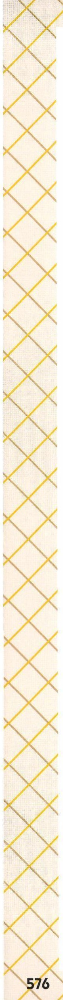

> **種類**: other  
> **説明**: ページ下部の装飾的な罫線模様とページ番号「576」を示す飾り枠。  
> **主要素**: ページ番号576, 菱形模様の装飾罫

### 弥生/飛鳥時代

### 奈良時代

### 2重要歴史人物

### ひみこ

卑弥呼

せい

3世紀

前半ごろ

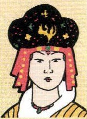

> **種類**: portrait  
> **説明**: 資料編の人物紹介と思われる肖像イラストで、星模様の入った黒い冠をかぶった女性の姿が描かれている。  
> **主要素**: 黒い冠, 十二単風の衣装, 女性の肖像
やまたいこく
邪馬台国の女王
ぎしんき魏に使いを送り「親魏わおうしょうごう
倭王」の称号と金印、どうきょうさず
銅鏡などを授かった

### おおきみワカタケル大王(5世紀後半ごろ)
やまとちよういぶ
大和朝廷の大王「武」
ちようせん
朝鮮半島の国々に対し
ゆうい
優位に立つため、中国
に使いを送った

### しょうとくたいし聖徳太子
(574~622)

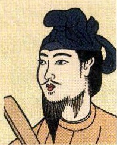

> **種類**: portrait  
> **説明**: 資料編の人物紹介と思われる肖像イラストで、ひげをたくわえ布を羽織った男性の姿が描かれている。  
> **主要素**: ひげ, 頭巾, 男性の肖像
すいこんのうせつしょう

推古天皇の摂政

かんいじうしちじょう
冠位十二階·十七条の
けんぽうせいてい

憲法を制定した

ほうりうじ

法隆寺を建てた

### おののいもこ小野妹子
6~7世紀前半ごろ

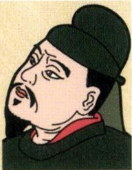

> **種類**: portrait  
> **説明**: 資料編の人物紹介と思われる肖像イラストで、黒い烏帽子をかぶった男性の横向きの肖像。  
> **主要素**: 黒い烏帽子, 男性の肖像
聖徳太子の命受け、けんずいし
遣隋使として中国にわ
こうていたり、国書を隋の皇帝にわたした

### かのおおえのおうじ中大兄皇子(626~671)

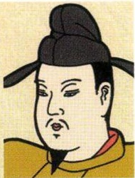

> **種類**: portrait  
> **説明**: 資料編の人物紹介と思われる肖像イラストで、烏帽子をかぶった公家風の男性の肖像。  
> **主要素**: 烏帽子, 公家装束, 男性の肖像
んじ

のちの天智天皇

がのえみしいるか
蘇我蝦夷·蘇我入鹿を
たおした

たいかかいしん

大化の改新を行った

### かみのまたり中臣鎌足(614~669)

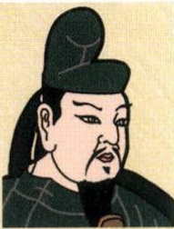

> **種類**: portrait  
> **説明**: 資料編の人物紹介と思われる肖像イラストで、黒い冠をかぶった武将・公家風の男性の肖像。  
> **主要素**: 黒い冠, 男性の肖像
中大兄皇子と協力して大化の改新を進めたふじわらせい
藤原の姓をもらい、藤
そ
原氏の祖となった
しょうむてんのう聖武天皇(701~756)

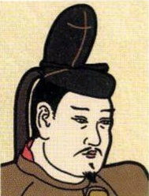

> **種類**: portrait  
> **説明**: 資料編の人物紹介と思われる肖像イラストで、黒い冠をかぶった男性の肖像。  
> **主要素**: 黒い冠, 男性の肖像
こくぶんじ
国ごとに国分寺・国分
にじとうだいじ
尼寺、奈良に東大寺を
二んり0うぶつまよう
建立し、仏教の力で国
を守ろうとした

### ようき行基(668~749)

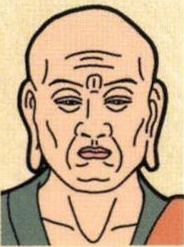

> **種類**: portrait  
> **説明**: 資料編の人物紹介と思われる肖像イラストで、剃髪した僧侶の肖像。  
> **主要素**: 剃髪, 僧衣, 男性の肖像
ふきょう
人々に仏教を布教し、橋や用水路つった東大寺の大仏づくりに協力した
がんじん鑑真(688~763)

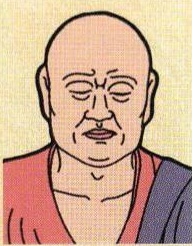

> **種類**: portrait  
> **説明**: 資料編の人物紹介と思われる肖像イラストで、目を閉じた剃髪の僧侶の肖像。  
> **主要素**: 剃髪, 僧衣, 閉じた目
とうこうそう

唐の高僧

こうかい

6度目の航海で来日に
かいりつ

成功し、戒律を伝えた
とうしようだいじ

唐招提寺を建立した
かんむてんのう桓武天皇(737~806)

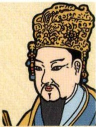

> **種類**: portrait  
> **説明**: 資料編の人物紹介と思われる肖像イラストで、豪華な冠をかぶった中国風の人物の肖像。  
> **主要素**: 豪華な冠, ひげ, 中国風衣装
ながおかきうへいあんきう
都を長岡京·平安京
うつ

移した

りつりうせじ

律令政治の立て直しを
はかった

### さいちょう最澄(767~822)

> **種類**: portrait  
> **説明**: 資料編の人物紹介と思われる肖像イラストで、頭巾をかぶった女性の肖像。  
> **主要素**: 頭巾, 女性の肖像
<うかい

遣唐使船で空海ととも
に唐にわたった僧
ひえいさん元りじ

比叡山に延暦寺を建て
んだいしう

天台宗を広めた
すがわらのみちざね菅原道真(845~903)

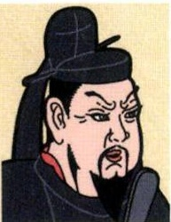

> **種類**: portrait  
> **説明**: 資料編の人物紹介と思われる肖像イラストで、黒い冠をかぶり鋭い目つきの男性の肖像。  
> **主要素**: 黒い冠, 鋭い目つき, 男性の肖像
はけんい

遣唐使の派遣停止を進
言した

いんぼうしつきく
藤原氏の陰謀で失脚
「学問の神様」

---
[← p.579](page_0579.md) | [📖 目次](index.md) | [p.581 →](page_0581.md)
