# p.581 (印刷頁 577)
[← p.580](page_0580.md) | [📖 目次](index.md) | [p.582 →](page_0582.md)

---

### 平安時代

### 鎌倉時代
ふじわのみちが藤原道長(966~1027)

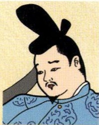

> **種類**: portrait  
> **説明**: 資料編の人物紹介と思われる肖像イラストで、烏帽子をかぶった公家風の男性の肖像。  
> **主要素**: 烏帽子, 公家装束, 男性の肖像
せつしょうせつんいじ摂政となり、摂関政治を行った
よりち
子の頼通とともに藤原
ぜんせいきず氏の全盛時代を築いた

### むさきしきぶ紫式部
せいき10~11世紀初めごろ

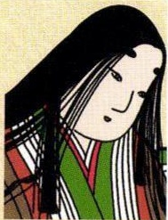

> **種類**: portrait  
> **説明**: 資料編の人物紹介と思われる肖像イラストで、長い黒髪の女性の肖像。  
> **主要素**: 長い黒髪, 十二単風の衣装, 女性の肖像
いちじょうてんのうちうぐうょう·一条天皇の中宮彰子むすめ
(藤原道長の娘)に仕えた
げんじあらわ小説『源氏物語』を著した

### せいしようなん清少納言（10~11世紀初めごろ

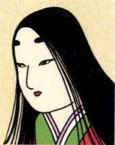

> **種類**: portrait  
> **説明**: 資料編の人物紹介と思われる肖像イラストで、長い黒髪の女性の肖像。  
> **主要素**: 長い黒髪, 十二単風の衣装, 女性の肖像
こうこうていし一条天皇の皇后定子みちたか
(藤原道隆の娘)に仕えたずいひつまく5のそうし
随筆『枕草子』著した

### しらかわてんのう白河天皇
(1053~1129)
じょうこう

上皇となってからも、
せいけん

政権の実権をにぎって
いんせい

院政を始めた

### たいのきよもり平清盛
(1118~1181)

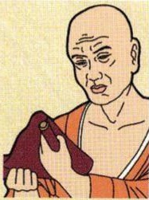

> **種類**: portrait  
> **説明**: 資料編の人物紹介と思われる肖像イラストで、赤い布を手にした剃髪の僧侶の肖像。  
> **主要素**: 剃髪, 僧衣, 赤い布
ぶしだいじょう武士として最初の太政大臣となり、政治の実権をにぎった
にそうぼうえき
日宋貿易を行った

### ものよしつね源義経(1159~1189)

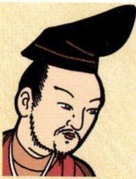

> **種類**: portrait  
> **説明**: 資料編の人物紹介と思われる肖像イラストで、黒い烏帽子をかぶりひげをたくわえた男性の肖像。  
> **主要素**: 黒い烏帽子, ひげ, 男性の肖像
へいしう
平氏打倒の中心となつ
た
めつぼうよりとも
平氏滅亡後、兄頼朝
ころ
対立して殺された

### みものよりも源頼朝
(1147~1199)
はけん
弟の義経らを派遣してかまくら平氏をほろぼし、鎌倉ばくふ
に幕府を開いた
ごじとうせつち守護・地頭を設置した
フビライハン(1215~1294)
ていこくこうでいモンゴル帝国第5代皇帝げん
国号を元とし、日本を2度せめたが、失敗した

### ほうじようまさ
北条政子
(1157~1225)

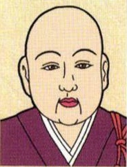

> **種類**: portrait  
> **説明**: 資料編の人物紹介と思われる肖像イラストで、剃髪した僧侶の肖像。  
> **主要素**: 剃髪, 僧衣, 男性の肖像
つま
源頼朝の妻。頼朝の死後出家し、父や弟とと
あまもに政治を行い、「尼しょうぐん
将軍」といわれた

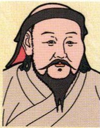

> **種類**: portrait  
> **説明**: 資料編の人物紹介と思われる肖像イラストで、外国風の帽子をかぶりひげをたくわえた人物の肖像。モンゴル(元)の指導者を思わせる装いである。  
> **主要素**: 外国風の帽子, ひげ, モンゴル風の衣装

### ほうじようときむね北条時宗

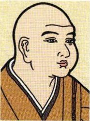

> **種類**: portrait  
> **説明**: 資料編の人物紹介と思われる肖像イラストで、剃髪した僧侶の肖像。  
> **主要素**: 剃髪, 僧衣, 男性の肖像
しつけん
鎌倉幕府第8代執権しゆうらいさい2度の元の襲来の際、けんとうそつしりぞ御家人を統率し、退けた

### ことばじょうこう後鳥羽上皇(1180~1239)

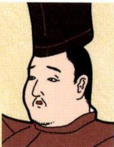

> **種類**: portrait  
> **説明**: 資料編の人物紹介と思われる肖像イラストで、黒い冠をかぶった男性の肖像。  
> **主要素**: 黒い冠, 男性の肖像
じょうきのうらん
1221年、承久の乱に敗お
れ、隠岐に流された
さいえ(ていか)こきん藤原定家らに『新古今和歌集』をまとめさせた

### たけ竹崎季長(1246~?)

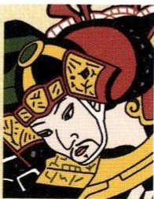

> **種類**: portrait  
> **説明**: 資料編の人物紹介と思われる肖像イラストで、兜をかぶった武将の肖像。  
> **主要素**: 兜, 鎧, 武将の肖像
げんこうかつやく

元での活躍を幕府に
うつたえた御家人
もうこえことば

「蒙古襲来絵詞」をえが
かせた

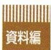

> **種類**: other  
> **説明**: 章の区切りを示す見出しラベルで、「資料編」の文字が縦縞模様の背景に配置されている。  
> **主要素**: 資料編の文字, 縦縞模様の背景
政

治

---
[← p.580](page_0580.md) | [📖 目次](index.md) | [p.582 →](page_0582.md)
