# p.582 (印刷頁 578)
[← p.581](page_0581.md) | [📖 目次](index.md) | [p.583 →](page_0583.md)

---

### 南北朝(室町時代

### 室町安土桃山時代

### だいこてんのう後醍醐天皇(1288~1339)
まらばくふ
鎌倉幕府をほろぼした
け人しんせい
後、建武の新政を始め
たが2年半で失敗
よしのなんちよう
吉野で南朝を開いた

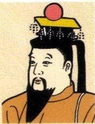

> **種類**: portrait  
> **説明**: 資料編の人物紹介と思われる肖像イラストで、赤い玉の飾りが付いた冠をかぶり長いひげをたくわえた男性の肖像。中国の皇帝を思わせる装いである。  
> **主要素**: 赤い玉の冠飾り, 長いひげ, 中国風衣装

### あしかがたかうじ足利尊氏

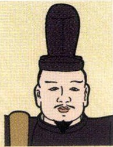

> **種類**: portrait  
> **説明**: 資料編の人物紹介と思われる肖像イラストで、高い黒帽子をかぶった男性の肖像。  
> **主要素**: 高い黒帽子, 男性の肖像
建武の新政に反対し挙兵ほくちょうせい北朝の天皇から征夷大しようぐんにん
将軍に任じれ、京都
むろまち
に室町幕府を開いた

### あしかがよしみつ足利義満(1358~1408)

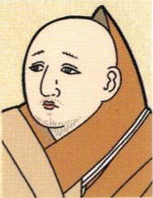

> **種類**: portrait  
> **説明**: 資料編の人物紹介と思われる肖像イラストで、頭巾をかぶった僧侶風の男性の肖像。  
> **主要素**: 頭巾, 僧衣風の衣装, 男性の肖像
室町幕府第3代将軍
とういつ
南北朝を統一した
まんかく
北山に金閣を建てた
ちみんかんごうぼうえき
日明（勘合）貿易を始めた

### ぜあみ世阿弥

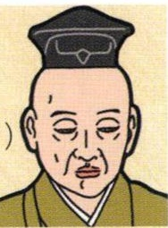

> **種類**: portrait  
> **説明**: 黒い頭巾状の帽子をかぶった高齢の男性の肖像イラスト。僧侶または学者風の人物と思われる。  
> **主要素**: 黒い頭巾, 高齢の男性, 僧衣風の衣装
(1363？~1443？)
かんあみ
父観阿弥とともに足利
ほのう義満の保護を受け、能を大成した

### あしかがよしまさ足利義政(1436~1490)

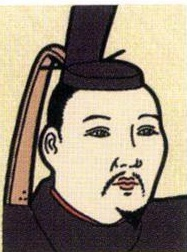

> **種類**: portrait  
> **説明**: 長く垂れた黒い冠(えぼし)をかぶった若い公家・武士風の男性の肖像イラスト。  
> **主要素**: 黒い長えぼし, 口ひげ, 公家風装束
·室町幕府第8代将軍おうあとつぎをめぐって応にん5ん
仁の乱がおこったひかしやまんかく
東山に銀閣を建てた

### せしう雪舟(1420~1506)

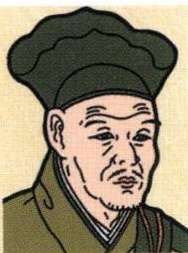

> **種類**: portrait  
> **説明**: 緑色の頭巾をかぶった高齢の僧侶風男性の肖像イラスト。しわの多い顔が特徴的。  
> **主要素**: 緑の頭巾, 高齢の僧侶風人物, しわの表現
みんすいぼくが明にわたり、水墨画を学んだ
明から帰国後、日本的な水墨画様式を完成

### フランシスコ=ザビエル
イエズス会のスペインせんきう
人宣教師
鹿児島に上陸し、日本にキリスト教を伝えた

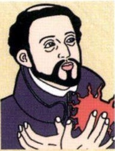

> **種類**: portrait  
> **説明**: 西洋人宣教師風のひげを蓄えた男性が両手で赤く燃える心臓を掲げている肖像イラスト。フランシスコ・ザビエルを描いた定番の図像と思われ、キリスト教伝来に関する説明で使われる。  
> **主要素**: 西洋人宣教師, 燃える心臓, 黒い衣装, ひげ

### おたのぶが織田信長

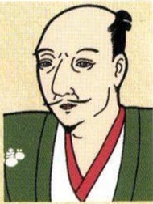

> **種類**: portrait  
> **説明**: 月代(さかやき)を剃った武将風の男性の肖像イラスト。緑の着物に赤い衿を合わせている。  
> **主要素**: 月代頭, 口ひげ, 緑の着物, 赤い衿
室町幕府をほろぼしたながしの1C2長篠の戦いで鉄砲を活用あつちきず
安土城を築いたくいちらくさじつし楽市・楽座を実施した

### とよとみひでよし豊臣秀吉
(1537~1598)

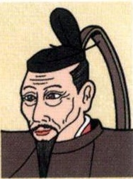

> **種類**: portrait  
> **説明**: 長い冠をかぶり顎ひげを蓄えた高齢の武将・公家風男性の肖像イラスト。  
> **主要素**: 黒い長えぼし, 顎ひげ, しわの表現
けんちかがり

検地、刀狩を実施した
大阪城をいた

1590年に全国統一
ばんねんちょうせんしんりやく
晩年に朝鮮を侵略した

### あけちみつひ明智光秀
(1528？~1582)

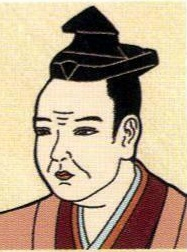

> **種類**: portrait  
> **説明**: 黒い三角形の頭巾(烏帽子風)をかぶった恰幅の良い男性の肖像イラスト。  
> **主要素**: 黒い三角頭巾, 恰幅の良い体格, 着物姿

### せんりきう千利休

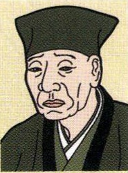

> **種類**: portrait  
> **説明**: 緑の頭巾をかぶった高齢の僧侶風男性の肖像イラスト。1403と類似した様式。  
> **主要素**: 緑の頭巾, 高齢の僧侶風人物

### いずもおくに出雲の阿国
せい
(16〜17世紀初めごろ

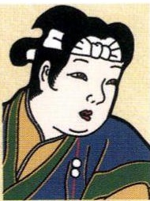

> **種類**: portrait  
> **説明**: 丸顔で優しい表情の若い人物の肖像イラスト。若年の貴族または女性的な人物と思われる。  
> **主要素**: 丸顔, 青と緑の衣装, 若い人物
ほんのうじ

本能寺で織田信長をお
そって自害させた
やまざき

山崎の戦いで豊臣秀吉
に敗れた
さかい
堺（大阪府）の商人出身織田信長・豊臣秀吉仕え、わび茶の作法を完成した
7
出雲大社の巫女といわ
れる

おど
京都でかぶき踊りを始
めた

---
[← p.581](page_0581.md) | [📖 目次](index.md) | [p.583 →](page_0583.md)
