# p.583 (印刷頁 6LS)
[← p.582](page_0582.md) | [📖 目次](index.md) | [p.584 →](page_0584.md)

---

### 江戸時代
とくがわいえやす徳川家康(1542~1616)

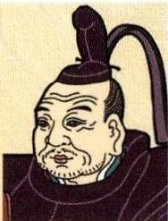

> **種類**: portrait  
> **説明**: 長い冠と顎ひげを蓄えた高齢の武将風男性の肖像イラスト。将軍・大名風の人物と思われる。  
> **主要素**: 黒い長えぼし, 顎ひげ, 武将風の装束
せは
1600年、関ヶ原の戦い
に勝利した
せいいたいしょうぐん
1603年、征夷大将軍にな
えどばくふ
り、江戸幕府を開いた

### とくがわいえつ徳川家光(1604~1651)

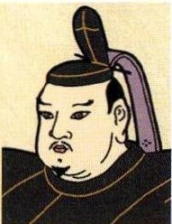

> **種類**: portrait  
> **説明**: 紫の垂れ布のついた冠をかぶった恰幅の良い男性の肖像イラスト。  
> **主要素**: 黒い冠, 紫色の垂れ布, 恰幅の良い体格
江戸幕府第3代将軍さんきんこうたいせいど
参勤交代を制度化したんキリス卜教を禁止し、さこく
鎖国の体制を固めた
シャクシャイン(?~1669)

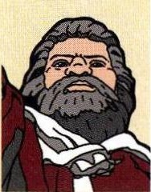

> **種類**: portrait  
> **説明**: 白髪交じりの豊かなひげを蓄えた荒々しい印象の男性の肖像イラスト。赤い衣装をまとっている。  
> **主要素**: 白髪のひげ, 赤い衣装, 力強い表情
アイヌの首長
二う元きどくせんアイヌとの交易を独占し、不正取り引きを行
まつまえはん
う松前藩と戦った

### とくがわつなし徳川綱吉
(1646~1709)

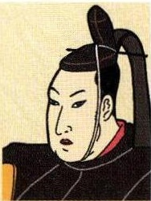

> **種類**: portrait  
> **説明**: 長い冠をかぶった若い公家風男性の横顔を描いた肖像イラスト。赤い衿が特徴的。  
> **主要素**: 黒い長えぼし, 赤い衿, 横顔
江戸幕府第5代将軍しょうるいあわれれい
生類憐みの令を出したししがくしようれいぶんち朱子学を奨励し、文治せいじてんかん
政治に転換した

### ちかまつもんさえもん近松門左衛門(1653~1724)

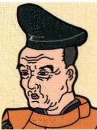

> **種類**: portrait  
> **説明**: 黒い平たい頭巾をかぶった高齢のしわの多い男性の肖像イラスト。オレンジ色の衣装をまとっている。  
> **主要素**: 黒い平頭巾, しわの表現, オレンジ色の衣装
げんろくか元禄文化を代表する歌ぶじょうりきゃく舞伎や人形浄瑠璃の脚ほん
本家
ねきんじうあら『曽根崎心中』などを著した

### とくがわよしね徳川吉宗(1684~1751)

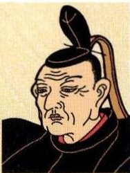

> **種類**: portrait  
> **説明**: 長い冠をかぶった高齢のしわの多い男性の肖像イラスト。将軍風の人物と思われる。  
> **主要素**: 黒い長えぼし, しわの表現, 高齢の男性
江戸幕府第8代将軍
きょうほうかいかく
享保の改革を行った
あげまいめやすばこ
上米の制、目安箱
くしかさが
公事方御定書をつくった
まつだいらさだのふ松平定信(1758~1829)

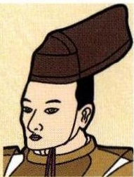

> **種類**: portrait  
> **説明**: 茶色い大きな頭巾をかぶった若い男性の肖像イラスト。  
> **主要素**: 茶色の頭巾, 若い男性, 着物姿
しかわはんし
白河藩主
ろうじう
老中となり、享保の改
かんせい
革を手本とした寛政の
改革を行った

### みずのただくに水野忠邦(1794~1851)

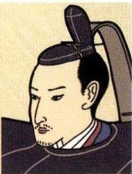

> **種類**: portrait  
> **説明**: 長い冠をかぶり口ひげを蓄えた若い公家・武士風男性の肖像イラスト。  
> **主要素**: 黒い長えぼし, 口ひげ, 若い男性
てんぽう

老中として天保の改革
を行った

まかいさん

株仲間の解散を命じた
あげちれい

上知令を出したが失敗
じょうち
おおしおへいはちろう大塩平八郎(1793~1837)

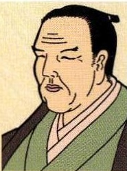

> **種類**: portrait  
> **説明**: 月代頭で目を閉じた恰幅の良い中年男性の肖像イラスト。緑の着物姿。  
> **主要素**: 月代頭, 恰幅の良い体格, 緑の着物
まちぶきうしょ

大阪町奉行所の元役人
ようめい

陽明学者

ひんみんきうさい

貧民救済のために大阪
で挙兵した

### うたがわひろしげ歌川広重
(1797~1858)

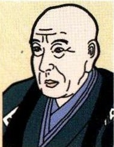

> **種類**: portrait  
> **説明**: 丸眼鏡のような目つきの高齢の男性の肖像イラスト。学者・僧侶風の人物と思われる。  
> **主要素**: 丸い目, 高齢の男性, 灰色の衣装
かせいうき化政文化を代表る浮よし
世絵師
とう代表作に風景画の「東かどうこしうさんつき
海道五十三次」がある

### とおりのりなが本居宣長
(1730~1801)

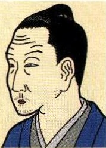

> **種類**: portrait  
> **説明**: 髷を結った中年男性の肖像イラスト。青い着物をまとっている。  
> **主要素**: 髷, 青い着物, 中年男性
こじきでんあらわ

『古事記伝』を著して国
学を大成した

んのうじょうい

国学は尊王攘夷運動に
えいきょう

影響をあたえた

### すぎたげんばく杉田玄白
(1733~1817)

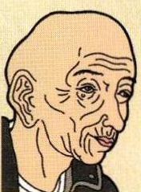

> **種類**: portrait  
> **説明**: 頭髪の薄い高齢の男性の肖像イラスト。しわの多い顔が特徴的で、江戸時代の人物と思われる。  
> **主要素**: 禿頭, しわの表現, 高齢の男性
んがくしやおばまはんい蘭学者で小浜藩医『ターヘルナトミほんやくかいたいしんア』を翻訳し、『解体新中しつばん
書』として出版した

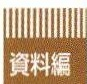

> **種類**: other  
> **説明**: 茶色の縦じま模様の背景に「資料編」と白抜き文字で書かれた見出しバナー。教科書・参考書の章区切りとして使われる装飾。  
> **主要素**: 見出しバナー, 資料編の文字, 縦じま模様
地

理
治
歷史

国

荆

---
[← p.582](page_0582.md) | [📖 目次](index.md) | [p.584 →](page_0584.md)
