# p.584
[← p.583](page_0583.md) | [📖 目次](index.md) | [p.585 →](page_0585.md)

---

### 江戸）明治時代

> **種類**: other  
> **説明**: 紫色の背景に「明治時代」と白抜き文字で縦書きされた見出しバナー。この後に続く明治時代関連の人物紹介の章扉と思われる。  
> **主要素**: 見出しバナー, 明治時代の文字, 紫色の背景

### いのうただたか伊能忠敬
(1745~1818)

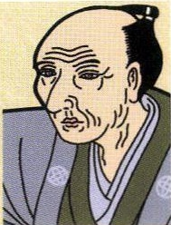

> **種類**: portrait  
> **説明**: 髷を結い羽織を着た高齢の武士風男性の肖像イラスト。幕末から明治初期の人物と思われる。  
> **主要素**: 髷, 羽織姿, しわの表現
えんがんりよう
全国の沿岸を測量し、せいかく
正確な地図をつくった
だいにほんんいよ死後、「大日本沿海輿ちぜんず
地全図」が完成した
めいじてんのう明治天皇(1852~1912)

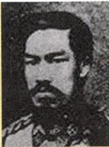

> **種類**: portrait  
> **説明**: 西洋風の軍服を着てひげを蓄えた外国人男性の肖像写真(セピア調)。幕末の黒船来航に関連する人物と思われる。  
> **主要素**: 西洋式軍服の襟, ひげ, 白黒写真
ごかじようこせいもん
五箇条の御誓文を神にしめ
ちかう形で示した
ていこくけんぽうはつふ大日本帝国憲法を発布し、立憲政治を始めた

### ペリー
(1794~1858)

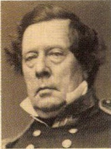

> **種類**: portrait  
> **説明**: 巻き毛の白髪で西洋式の礼装を着た高齢の外国人男性の肖像写真(セピア調)。  
> **主要素**: 白髪の巻き毛, 西洋式礼装, 白黒写真
かんい
東インド艦隊司令長官
うがらいこうとして浦賀に来航した日本に開国を求め1854年、
じうやく
日米和親条約を結んだ

### ふくざわゆきち福沢諭吉
(1834~1901)
ふぜんなかつはん

豊前中津藩出身

けいおう
思想家・教育者で慶應
じうせつ

義塾を創設した

(寸)あらわ
『学問のす)め』著した

### いいなおすけ井伊直弼(1815~1860)

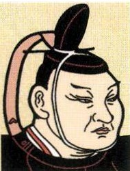

> **種類**: portrait  
> **説明**: 長い冠をかぶった恰幅の良い男性の肖像イラスト。江戸幕末期の将軍・大名風の人物と思われる。  
> **主要素**: 黒い長えぼし, 恰幅の良い体格, 着物姿

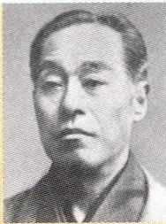

> **種類**: portrait  
> **説明**: 白髪で和装をまとった高齢男性の肖像写真(白黒)。明治時代の人物と思われる。  
> **主要素**: 白髪, 和装, 白黒写真
たいろうしうこう大老として日米修好通商条約を結んだあんせいたいこく
安政の大獄を行ったさくだ
桜田門外で暗殺された

### いたがきたいすけ板垣退助

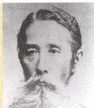

> **種類**: portrait  
> **説明**: 白い豊かなあごひげと口ひげを蓄えた男性の肖像写真(白黒)。明治時代の政治家・要人と思われる。  
> **主要素**: 白いあごひげ, 口ひげ, 白黒写真
土佐藩出身

みんけん

自由民権運動の指導者
かつやく

として活躍した
とう

自由党を結成した

### かつかいしう勝海舟
(1823~1899)

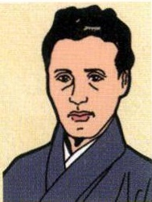

> **種類**: portrait  
> **説明**: 和装の若い男性の肖像イラスト。明治時代初期の人物と思われる。  
> **主要素**: 和装, 若い男性, 髪型
ばくしんさいこうかもり
幕臣。西郷隆盛と会見し、えどじつげん江戸城の無血開城実現かりんま
咸臨丸艦長とし太平
おうだん
洋を横断した

### さかりうま坂本龍馬
(1835~1867)
とさはん

土佐藩出身

さつちょうとうめいちうかい

薩長同盟を仲介した
たいせいほうかんすいしん
大政奉還を推進した
あんさつ

京都で暗殺された

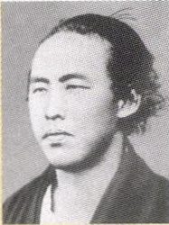

> **種類**: portrait  
> **説明**: 乱れた髪の若い男性の肖像写真(白黒)。幕末の志士風の人物と思われる。  
> **主要素**: 乱れた髪, 和装の襟元, 白黒写真

### とくがわよしのぶ徳川慶喜

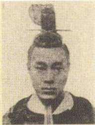

> **種類**: portrait  
> **説明**: 髷を結いながら西洋式の詰め襟服を着た若い男性の肖像写真(白黒)。和洋が混在する幕末・明治初期の過渡期を表す人物と思われる。  
> **主要素**: 髷, 西洋式詰め襟, 白黒写真
しょうぐん
江戸幕府第15代将軍ぜんはんし
土佐前藩主の進言を受け入れ、大政奉還を行った

### さいごうたかもり西郷隆盛
(1827~1877)

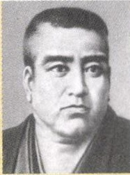

> **種類**: portrait  
> **説明**: がっしりとした体格で丸顔の男性の肖像写真(白黒)。和装をまとった明治時代の要人と思われる。  
> **主要素**: 丸顔, がっしりした体格, 和装, 白黒写真
さまはん

薩摩藩出身

とうばくしどう

倒幕を指導した

めいじ

明治新政府の中心人物
西南戦争に敗れ自決した

### おくぼしち大久保利通
(1830~1878)
薩摩藩出身
明治新政府の中心としはいはんちけんじんりよくて廃藩置県などに尽力しよ（さんこうょうすいしん
殖産興業を推進した

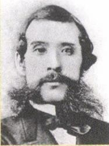

> **種類**: portrait  
> **説明**: 豊かなあごひげと口ひげを蓄え、西洋式の襟と蝶ネクタイを着けた若い男性の肖像写真(白黒)。  
> **主要素**: あごひげ, 蝶ネクタイ, 西洋式の襟, 白黒写真

### きどたよし木戸孝允

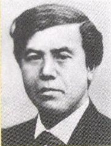

> **種類**: portrait  
> **説明**: スーツ姿の中年男性の肖像写真(白黒)。近代の政治家・要人風の人物と思われる。  
> **主要素**: スーツ, 整えられた髪, 白黒写真
ちょうしう

長州藩出身

倒幕を指導した

明治新政府の中心とな
った

---
[← p.583](page_0583.md) | [📖 目次](index.md) | [p.585 →](page_0585.md)
