# p.585 (印刷頁 581)
[← p.584](page_0584.md) | [📖 目次](index.md) | [p.586 →](page_0586.md)

---

### 明治時代

### 明治／大正／昭和時代

### おおくましげのぶ大隈重信
(1838~1922)

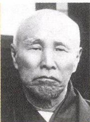

> **種類**: portrait  
> **説明**: 頭髪が薄く顎ひげを蓄えた高齢男性の肖像写真(白黒)。明治時代の軍人・政治家風の人物と思われる。  
> **主要素**: 禿頭, 顎ひげ, 白黒写真
ひぜんはん
肥前藩出身
りつけんかいしんとう
立憲改進党を結成したげんさいわせだそせつ現在の早稲田大学を創設
Cう中国に二十一か条の要求

### いとうひろぶみ伊藤博文
ちょうしう

長州藩出身

いかくうり

初代内閣総理大臣
ていこくきう
大日本帝国憲法を起草
かんこくとうかん

初代韓国統監

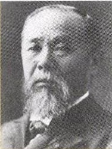

> **種類**: portrait  
> **説明**: 長く尖ったあごひげを蓄えた男性の肖像写真(白黒)。明治時代の政治家風の人物と思われる。  
> **主要素**: 尖ったあごひげ, 整えられた髪, 白黒写真

### むつむねみつ陸奥宗光

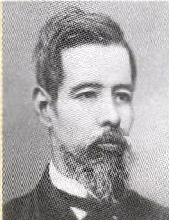

> **種類**: portrait  
> **説明**: あごひげを蓄え西洋式の襟を着けた若い男性の肖像写真(白黒)。明治時代の外交官・官僚風の人物と思われる。  
> **主要素**: あごひげ, 西洋式の襟, 白黒写真
がいむり上うじさい外務大臣として領事裁ばんけんちがいほうけんてつばい判権(治外法権)の撤廃に成功した
ものせ
下関条約を結んだ
とうごうへいはちろう東郷平八郎(1847~1934)

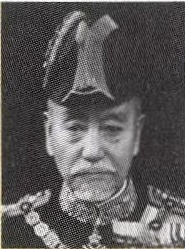

> **種類**: portrait  
> **説明**: 肩章や勲章の付いた軍服と軍帽を身につけた高齢男性の肖像写真(白黒)。明治時代の軍人と思われる。  
> **主要素**: 軍服, 軍帽, 肩章・勲章, 白黒写真
さまはん

薩摩藩出身の軍人
にちろ

日露戦争の日本海海戦
でロシアのバルチック
かんたいやぶ

艦隊を破った

### こむらじゆたろう小村寿太郎(1855~1911)
ポーツマス条約を結んだかんぜいじ外務大臣として関税自けんかいふく主権の完全回復に成功した

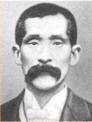

> **種類**: portrait  
> **説明**: 太い口ひげを蓄えスーツを着た男性の肖像写真(白黒)。明治時代の政治家・実業家風の人物と思われる。  
> **主要素**: 太い口ひげ, スーツ, 白黒写真

### たなかしうぞう田中正造

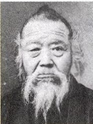

> **種類**: portrait  
> **説明**: 白いひげをたくわえた高齢の男性の肖像写真。和装姿で、明治〜昭和期に活躍した日本の人物と考えられる。  
> **主要素**: 白髪, 白いひげ, 和装, 肖像写真
あしおどうさんこうどくじけん
足尾銅山鉱毒事件につ
せふ
いて帝国議会で政府を
ついきゆうかいけつ
追及し、事件の解決に
一生をささげた

### のちひでよ野口英世
(1876~1928)

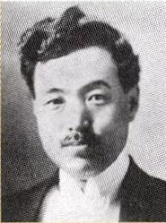

> **種類**: portrait  
> **説明**: 口ひげをたくわえた若い男性の肖像写真。洋装(スーツ)姿で、近代日本の人物と考えられる。  
> **主要素**: 口ひげ, 洋装, 肖像写真
さいきん

細菌学者

おうねつびょう

アフリカで黄熱病の研
みずかかんせん
究中、自らも感染して
なくなった

### よさのあき与谢野晶子
(1878~1942)

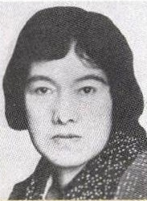

> **種類**: portrait  
> **説明**: おかっぱ風の髪型をした若い女性の肖像写真。大正〜昭和期に活躍した女性と考えられる。  
> **主要素**: 女性, 断髪, 肖像写真
大阪府出身の歌人がみしゆつぱん歌集『みだれ髪』を出版(う)
「君死にたまふことなかれ」を発表した

### はらたかし原敬
(1856~1921)

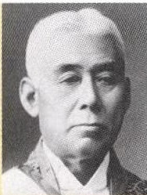

> **種類**: portrait  
> **説明**: 頭髪の薄い高齢の男性の肖像写真。勲章のような飾緒を付けた正装姿で、政治家または軍人と考えられる。  
> **主要素**: 高齢男性, 正装, 飾緒, 肖像写真
りつけんせいゆうかい
立憲政友会総裁として、こめそうどうほんかく米騒動後、初の本格的
そしきな政党内閣を組織した
さいしょうよ
「平民宰相」と呼ばれた
ひらつか(ちょう)平塚らいてう(1886~1971)

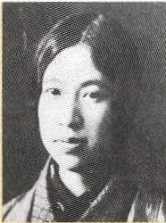

> **種類**: portrait  
> **説明**: 和装の若い女性の肖像写真。前髪を垂らした髪型で、近代の女性活動家や文学者と考えられる。  
> **主要素**: 女性, 和装, 肖像写真
じよせい
女性解放運動、女性参
とどう政権運動を指導したせいとうしやふじんせつりつ青社、新婦人協会設立C 
雑誌『青』を出版した

### いぬかいつよし犬養毅
(1855~1932)
こけんかつやく
護憲運動で活躍した立憲政友会内閣を組閣3いちごあんさつ五・一五事件で暗殺された

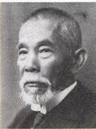

> **種類**: portrait  
> **説明**: 白いひげをたくわえた高齢男性の肖像写真。洋装のスーツ姿で、実業家または政治家と考えられる。  
> **主要素**: 白いひげ, 洋装, 肖像写真

### よしだしげる吉田茂

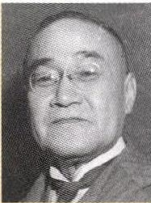

> **種類**: portrait  
> **説明**: 眼鏡をかけた中年男性の肖像写真。近代日本の人物と考えられる。  
> **主要素**: 眼鏡, 洋装, 肖像写真
サンフランシス平和条約調印と同時に、ほしょう
米安全保障条約を結んだ

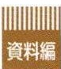

> **種類**: other  
> **説明**: 「資料編」と書かれた見出しタグのイラスト。本章の巻末資料セクションの扉ページを示す装飾。  
> **主要素**: 見出しタグ, 縞模様の背景
地

---
[← p.584](page_0584.md) | [📖 目次](index.md) | [p.586 →](page_0586.md)
