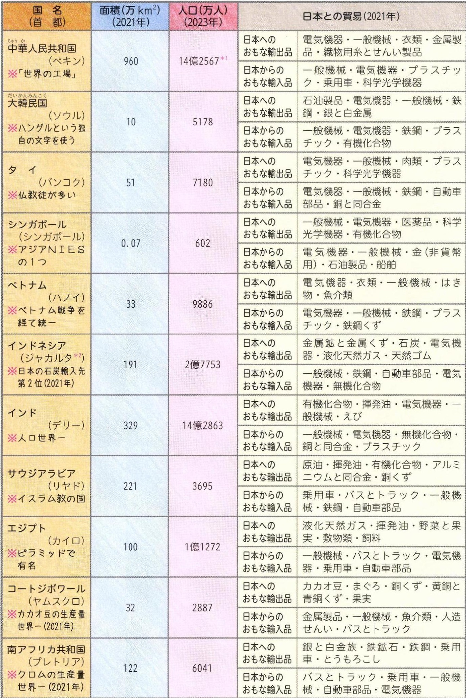

# p.586
[← p.585](page_0585.md) | [📖 目次](index.md) | [p.587 →](page_0587.md)

---

### 26世界のおもな国々の基礎データ

たいわん
*1ホコン、マカオ、台湾を除<*2ヌサ夕首都移転予定

---
[← p.585](page_0585.md) | [📖 目次](index.md) | [p.587 →](page_0587.md)
