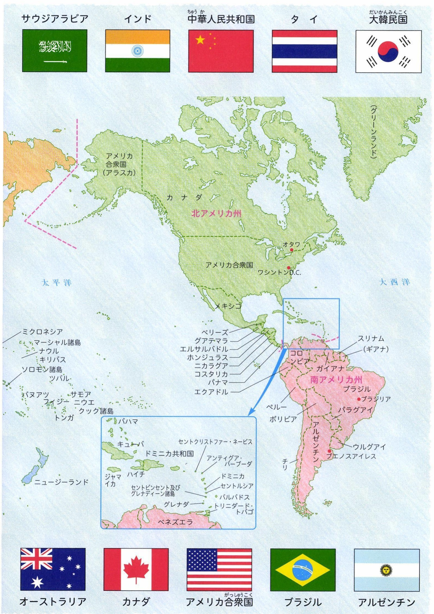

# p.589
[← p.588](page_0588.md) | [📖 目次](index.md) | [p.590 →](page_0590.md)

---

> **種類**: map  
> **説明**: 世界地図の一部で、北アメリカ州・南アメリカ州とカリブ海諸国の国名を示した地図。周囲に各国の国旗(サウジアラビア、インド、中国、タイ、韓国、オーストラリア、カナダ、アメリカ合衆国、ブラジル、アルゼンチンなど)が配置されている。  
> **主要素**: 北アメリカ州, 南アメリカ州, カリブ海諸国, 国旗, 首都(オタワ、ワシントンD.C.、ブラジリア、ブエノスアイレス)

---
[← p.588](page_0588.md) | [📖 目次](index.md) | [p.590 →](page_0590.md)
