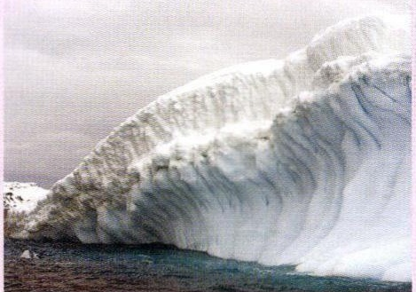
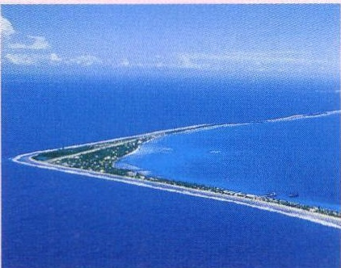
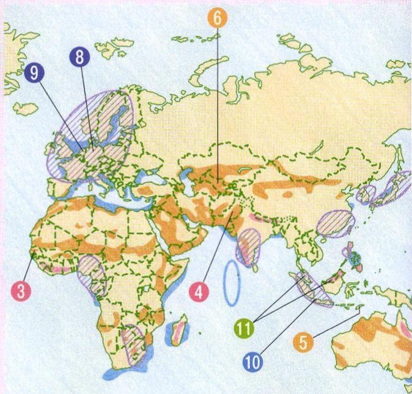
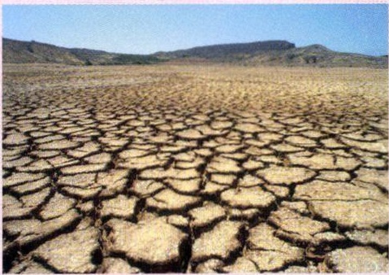
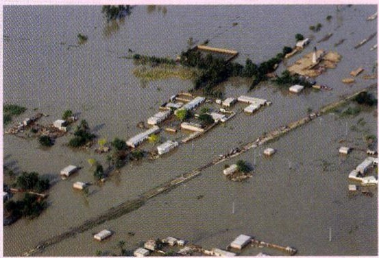
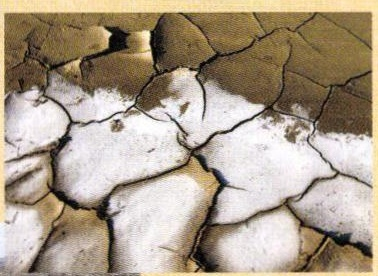
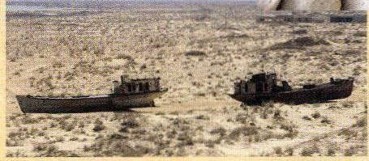
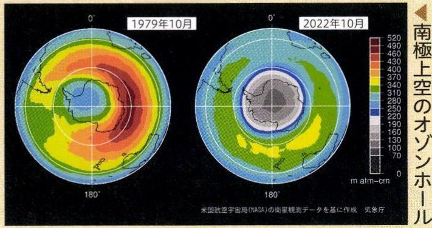

# p.590
[← p.589](page_0589.md) | [📖 目次](index.md) | [p.591 →](page_0591.md)

---

### 28地球環境問題

### おんだん
地球温暖化

### 地球温暖化のしくみ
2太陽光が地表で③再放射さはね返り、熱とた熱が温室して放射されるほうしや効果ガスの層にあたる

### 太陽
こうか①温室効果ガスの層なるが厚くあ室効果ガス排出
④地球の気温が上がる

> **種類**: photo  
> **説明**: 海に浮かぶ巨大な氷山の写真。地球温暖化による氷河・氷床の融解を示す資料写真。  
> **主要素**: 氷山, 海, 地球温暖化

> **種類**: photo  
> **説明**: サンゴ礁の環礁を上空から撮影した写真。海面上昇の影響を受けやすい低い島の様子を示す。  
> **主要素**: 環礁, サンゴ礁, 島, 上空写真

> **種類**: map  
> **説明**: ヨーロッパ・アフリカ・アジアにまたがる地域の地図に、番号付きの丸印(3,4,5,6,8,9,10,11)で特定の地域(酸性雨や砂漠化などの環境問題の発生地)を示した資料地図。  
> **主要素**: 番号記号, 地域指示, アフリカ, ヨーロッパ, アジア

### いじようきしょう地球温暖化による異常気象

> **種類**: photo  
> **説明**: ひび割れた乾燥した大地の写真。干ばつ・砂漠化の進行を示す資料写真。  
> **主要素**: ひび割れた大地, 乾燥, 砂漠化

> **種類**: photo  
> **説明**: 洪水で水没した街を上空から撮影した写真。住宅や道路が浸水している様子が写っている。  
> **主要素**: 洪水, 浸水した住宅, 上空写真
水不足と高温でひびC 
割れた地面
(③セネガル)

### さばく
砂漠化

### そうはかい
オゾソ層の破壊(7南極付近）

> **種類**: photo  
> **説明**: ひび割れて白く乾いた土壌を接写した写真。塩害または砂漠化による土地の劣化を示す。  
> **主要素**: ひび割れた土壌, 白い塩分, 接写

> **種類**: photo  
> **説明**: 干上がった湖底に取り残された漁船の写真。アラル海の縮小・砂漠化を象徴する資料写真。  
> **主要素**: 座礁した船, 干上がった湖, 砂漠化, アラル海

> **種類**: map  
> **説明**: 南極上空のオゾンホールを1979年10月と2022年10月で比較した衛星観測データの図。オゾン濃度を色分けで表し、オゾン層破壊の縮小(改善)傾向を示している。  
> **主要素**: オゾンホール, 南極, 色分け凡例, 衛星観測データ, 比較  
> **軸**: {"x": null, "y": null, "unit": "m atm-cm"}
げんいん
砂漠化の原因の1つである塩害(⑤東テモール）

---
[← p.589](page_0589.md) | [📖 目次](index.md) | [p.591 →](page_0591.md)
