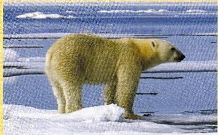
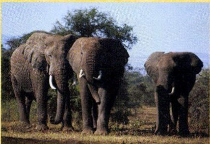
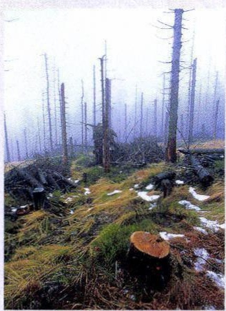
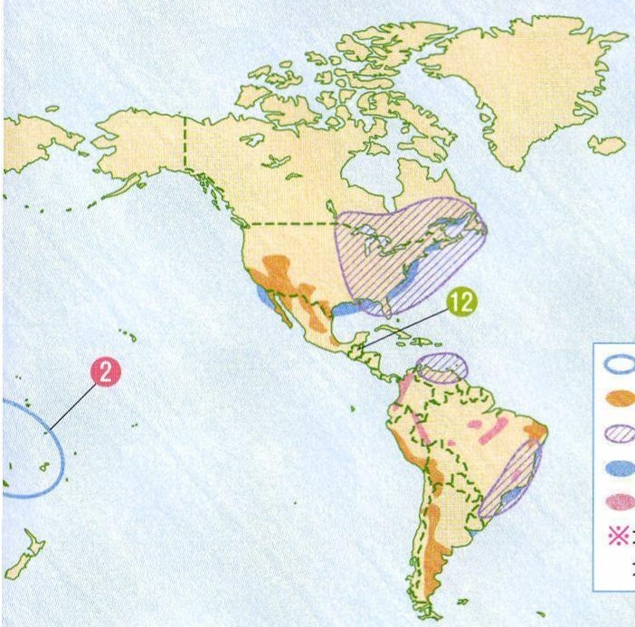
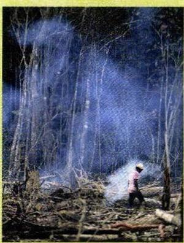
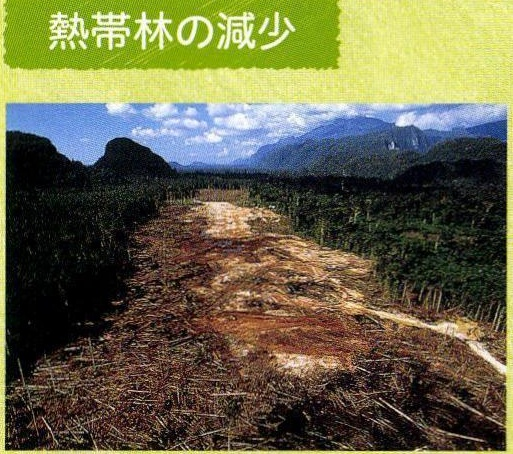
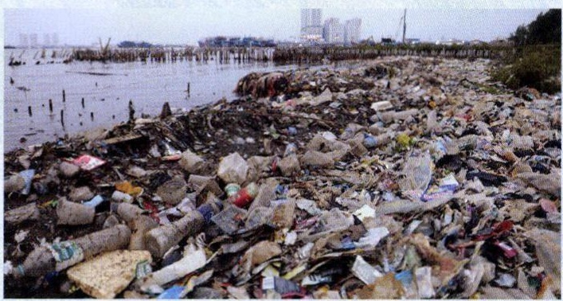
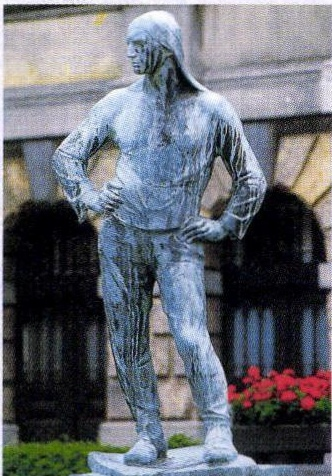

# p.591 (印刷頁 587)
[← p.590](page_0590.md) | [📖 目次](index.md) | [p.592 →](page_0592.md)

---

### げんしょう

野生生物の減少

ぜつめつきけんせい

絶滅の危険性がある動物
おんだんえい温暖化の影きよう
響を受けるホツキクグマ

> **種類**: photo  
> **説明**: 海氷の上に立つホッキョクグマの写真。地球温暖化による海氷減少で生息地が失われている様子を象徴する資料写真。  
> **主要素**: ホッキョクグマ, 海氷, 地球温暖化
はかい
自然破壊やらんかく
乱獲で減少するアフリカゾウ

> **種類**: photo  
> **説明**: アフリカのサバンナを歩く3頭のゾウの写真。野生生物と自然環境保護をテーマにした資料写真。  
> **主要素**: ゾウ, サバンナ, 野生動物

> **種類**: photo  
> **説明**: 立ち枯れた針葉樹林の写真。酸性雨による森林被害の様子を示す資料写真。  
> **主要素**: 枯れた木, 針葉樹林, 酸性雨被害

### おせん海洋污染

> **種類**: map  
> **説明**: 北アメリカ州・南アメリカ州の地図に、環境問題などの分布を示す色分け領域と番号記号(2、12)、凡例を付した資料地図。前ページの世界地図の続きと考えられる。  
> **主要素**: 番号記号2・12, 色分け領域, 凡例, 北アメリカ, 南アメリカ

> **種類**: photo  
> **説明**: 森林を伐採して火をつけ、煙が立ちのぼる中で作業する人の写真。焼畑や森林伐採による煙害を示す資料写真。  
> **主要素**: 伐採地, 煙, 人物, 焼畑

> **種類**: photo  
> **説明**: 「熱帯林の減少」という見出しの付いた写真。山あいの森林が伐採され、赤茶けた地面がむき出しになった様子を示す。  
> **主要素**: 伐採跡地, 熱帯林, 山, 赤土

> **種類**: photo  
> **説明**: 都市の海岸に大量のプラスチックごみが漂着している写真。海洋汚染問題を示す資料写真。  
> **主要素**: プラスチックごみ, 海岸, 都市部の建物, 海洋汚染
水没の危機にあるところ
砂漠化が進んでいるところ
酸性雨の被害があるところ
水がよごれているところ
熱帯林が減っているところ

> **種類**: photo  
> **説明**: 両手を腰に当てて立つ人物をかたどったブロンズ像の写真。街角に設置された記念像と考えられる。  
> **主要素**: ブロンズ像, 人物像, 街角

---
[← p.590](page_0590.md) | [📖 目次](index.md) | [p.592 →](page_0592.md)
