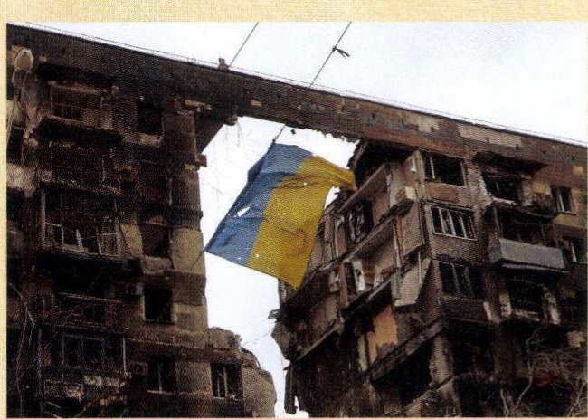
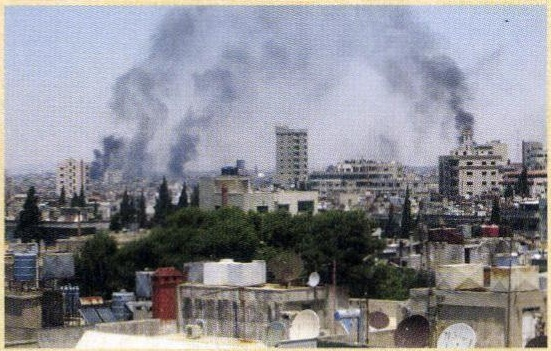
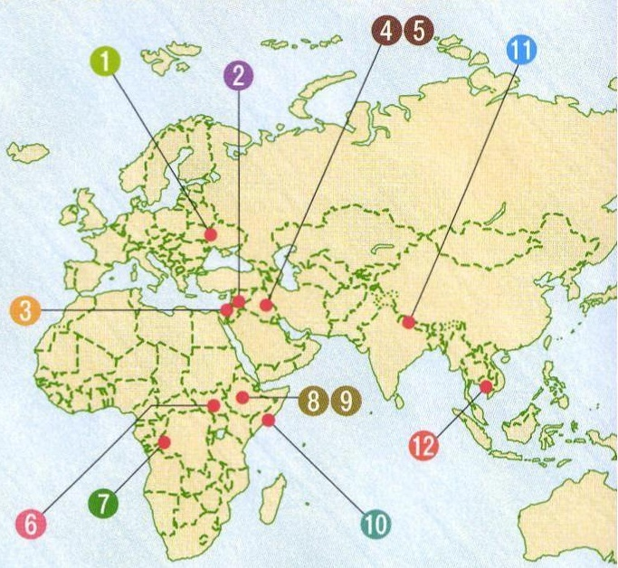
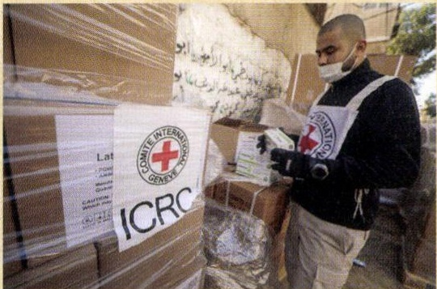
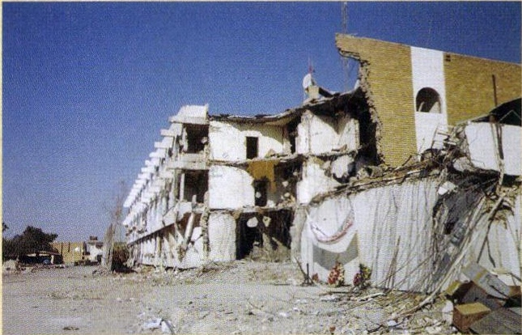
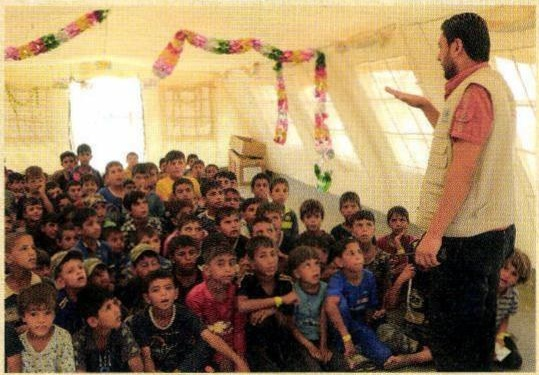
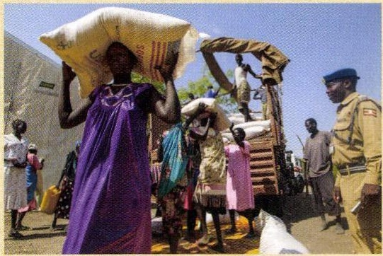
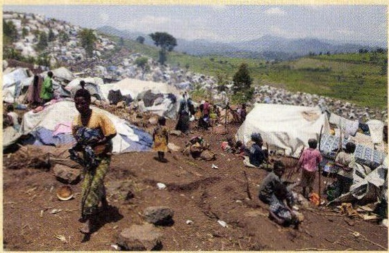

# p.592
[← p.591](page_0591.md) | [📖 目次](index.md) | [p.593 →](page_0593.md)

---

### 62世界の課題と平和への取り組み

> **種類**: photo  
> **説明**: 戦争で破壊された集合住宅の間にウクライナ国旗が掲げられている写真。紛争による被害を示す資料写真。  
> **主要素**: 破壊された建物, ウクライナ国旗, 紛争

> **種類**: photo  
> **説明**: 市街地から黒煙が立ちのぼる様子を撮影した写真。空爆や紛争による被害を示す資料写真。  
> **主要素**: 黒煙, 市街地, 紛争被害

> **種類**: map  
> **説明**: ヨーロッパ・アフリカ・アジアの地図に番号記号(1〜12)で地域紛争や難民問題の発生地を示した資料地図。  
> **主要素**: 番号記号1〜12, ヨーロッパ, アフリカ, アジア, 紛争地域

> **種類**: photo  
> **説明**: 赤十字国際委員会(ICRC)の職員が救援物資の箱を確認している写真。国際人道支援活動を示す資料写真。  
> **主要素**: 赤十字国際委員会(ICRC), 救援物資, 職員

> **種類**: photo  
> **説明**: 崩れ落ちた集合住宅の写真。紛争または災害による建物被害を示す資料写真。  
> **主要素**: 崩壊した建物, 被災地

> **種類**: photo  
> **説明**: 難民キャンプのテントの中で、多くの子どもたちが支援スタッフの話を聞いている写真。  
> **主要素**: 難民キャンプ, 子どもたち, 支援スタッフ, テント

> **種類**: photo  
> **説明**: アフリカの女性が支援物資の袋を頭に載せて運び、青いベレー帽の要員が見守る写真。国際的な食料支援活動を示す資料写真。  
> **主要素**: 食料支援物資, アフリカの女性, 国連要員

> **種類**: photo  
> **説明**: 山あいの斜面に無数のテントが立ち並ぶ難民キャンプを撮影した写真。  
> **主要素**: 難民キャンプ, テント群, 山あいの斜面

---
[← p.591](page_0591.md) | [📖 目次](index.md) | [p.593 →](page_0593.md)
