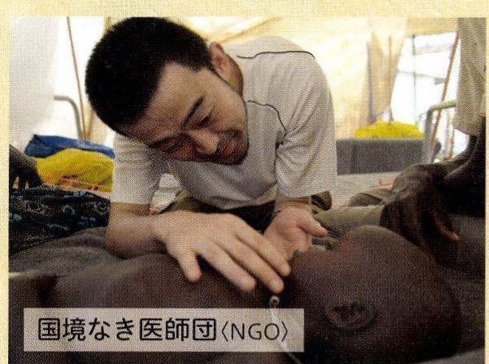
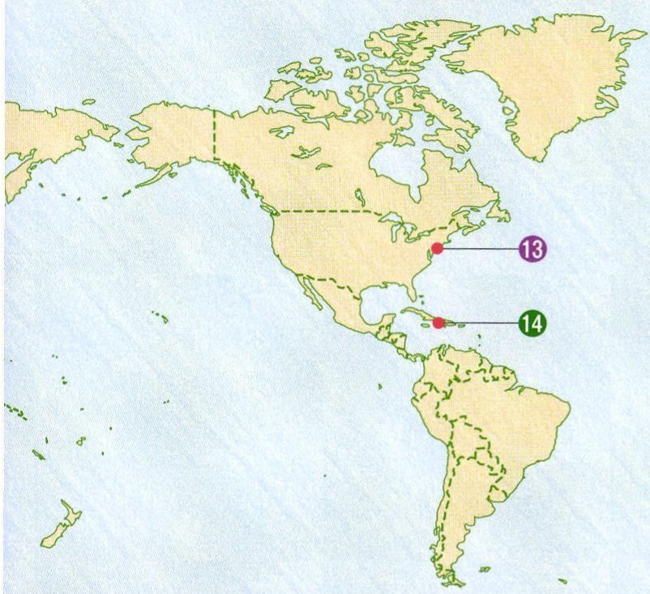
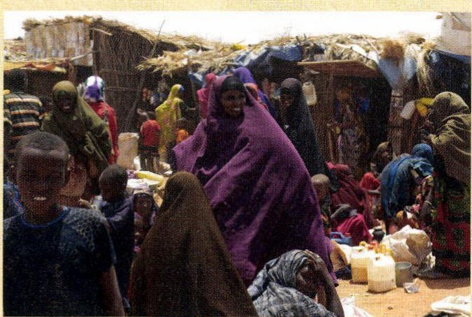
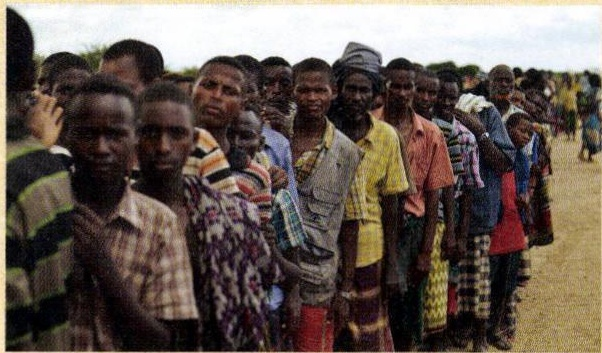
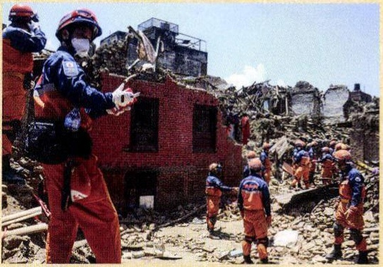
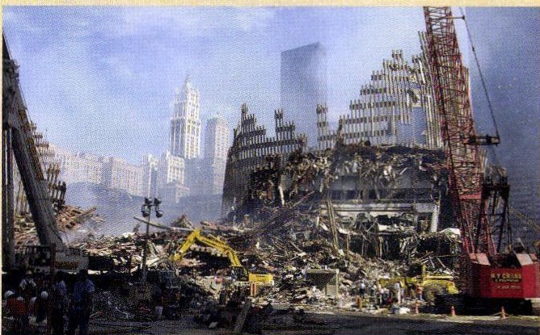
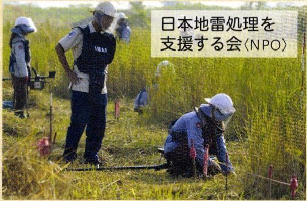
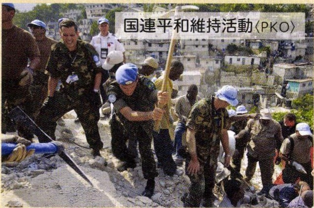

# p.593 (印刷頁 589)
[← p.592](page_0592.md) | [📖 目次](index.md) | [p.594 →](page_0594.md)

---

> **種類**: photo  
> **説明**: 「国境なき医師団〈NGO〉」の医師が現地の子どもを診察している写真。国際医療支援NGOの活動を示す。  
> **主要素**: 国境なき医師団, NGO, 医師, 診察
しようにかんじゃしんさついし
小児患者を診察する医師(8エチオピア)

> **種類**: map  
> **説明**: 北アメリカ州の地図に番号記号(13、14)で活動地域や支援拠点を示した資料地図。  
> **主要素**: 番号記号13・14, 北アメリカ州

> **種類**: photo  
> **説明**: 難民キャンプの市場のような場所に、色鮮やかな布をまとった女性や子どもたちが集まっている写真。  
> **主要素**: 難民キャンプ, 女性と子ども, 民族衣装

> **種類**: photo  
> **説明**: 支援物資の配給を待つ人々が長い列を作っている写真。難民支援の様子を示す資料写真。  
> **主要素**: 行列, 難民, 支援物資の配給待ち

> **種類**: photo  
> **説明**: 地震で倒壊した建物のがれきの中で、救助隊員が捜索・救助活動を行っている写真。  
> **主要素**: 倒壊した建物, 救助隊員, がれき, 地震被害

> **種類**: photo  
> **説明**: 崩壊した高層ビルのがれきと重機による撤去作業を撮影した写真。アメリカ同時多発テロ(9.11)後の現場と考えられる。  
> **主要素**: 崩壊したビル, 重機, 撤去作業, 同時多発テロ
じしんさいがいきゆう地震災害の救じよ
助活動を行う
きん日本の国際緊きゆ
急援助隊
(1ネパール)

> **種類**: photo  
> **説明**: 「日本地雷処理を支援する会〈NPO〉」のスタッフが草地で地雷探査・除去作業を行っている写真。  
> **主要素**: 日本地雷処理を支援する会, NPO, 地雷除去, 探査作業

> **種類**: photo  
> **説明**: 「国連平和維持活動〈PKO〉」に参加する各国要員が、被災地でがれき撤去などの復旧作業を協力して行っている写真。  
> **主要素**: 国連平和維持活動, PKO, 青いベレー帽, 復旧作業

---
[← p.592](page_0592.md) | [📖 目次](index.md) | [p.594 →](page_0594.md)
